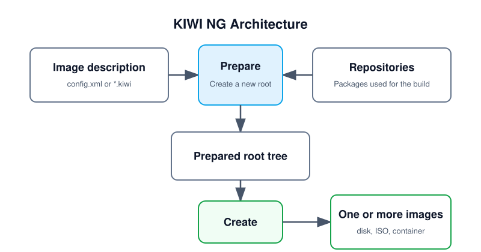

.. kiwi documentation master file

.. only:: suse

   .. include:: suse_metadata.rst

Welcome to KIWI NG
==================

**Build Linux images from one description in a predictable two-step workflow.**

KIWI NG is a command-line image builder for Linux distributions. It creates
bootable, reproducible images for virtual machines, cloud platforms, removable
media, containers, and specialized deployment targets.

.. note::
   This documentation covers {kiwi-product} |version|.

.. toctree::
   :maxdepth: 1
   :hidden:

   overview
   installation
   quickstart
   commands
   troubleshooting
   plugins
   concept_and_workflow
   image_description
   image_types_and_results
   examples
   contributing
   integration_testing

Build Architecture
------------------

   KIWI NG builds from an image description and the repositories that provide
   the packages for it. In the *prepare* step, KIWI creates a new root tree.
   In the *create* step, KIWI converts that prepared root tree into one or
   more image artifacts.

Diagram description:
   The diagram shows two required inputs: an image description and the
   repositories that contain the packages used for the build. Both feed the
   *prepare* step, which creates a new root tree. The *create* step then turns
   that prepared root tree into one or more images such as disk, ISO, or
   container artifacts.

The image description directory typically contains:

* :file:`config.xml` or a :file:`*.kiwi` file with the image definition.
* Repository definitions that point to the package sources used during the
  build.
* Optional overlays, archives, and shell hooks that customize the prepared
  root tree or the final image artifacts.

Why KIWI?
---------

* **One source, multiple outputs**: prepare a root filesystem once and create
  one or more image formats from it.
* **Declarative image definitions**: keep image metadata, repositories,
  packages, users, and storage settings in a versioned description.
* **Broad target support**: build for bare metal, virtual machines, cloud
  environments, live media, and containers.
* **Distribution-aware builds**: work with the package managers and repository
  layouts used by the supported Linux distributions.
* **Controlled customization**: extend builds with overlays, archives, and
  scripts when the schema alone is not enough.

.. sidebar:: Links

   * `GitHub Sources <https://github.com/OSInside/kiwi>`__
   * `GitHub Releases <https://github.com/OSInside/kiwi/releases>`__
   * `RPM Packages <http://download.opensuse.org/repositories/Virtualization:/Appliances:/Builder>`__
   * `Build Tests TumbleWeed(x86) <https://build.opensuse.org/project/show/Virtualization:Appliances:Images:Testing_x86:tumbleweed>`__
   * `Build Tests TumbleWeed(arm) <https://build.opensuse.org/project/show/Virtualization:Appliances:Images:Testing_arm:tumbleweed>`__
   * `Build Tests TumbleWeed(s390) <https://build.opensuse.org/project/show/Virtualization:Appliances:Images:Testing_s390:tumbleweed>`__
   * `Build Tests TumbleWeed(ppc64le) <https://build.opensuse.org/project/show/Virtualization:Appliances:Images:Testing_ppc:tumbleweed>`__

   * `Build Tests RawHide(x86) <https://build.opensuse.org/project/show/Virtualization:Appliances:Images:Testing_x86:rawhide>`__
   * `Build Tests RawHide(s390) <https://build.opensuse.org/project/show/Virtualization:Appliances:Images:Testing_s390:rawhide>`__

   * `Build Tests Leap(x86) <https://build.opensuse.org/project/show/Virtualization:Appliances:Images:Testing_x86:leap>`__

   * `Build Tests Fedora(x86) <https://build.opensuse.org/project/show/Virtualization:Appliances:Images:Testing_x86:fedora>`__
   * `Build Tests Fedora(arm) <https://build.opensuse.org/project/show/Virtualization:Appliances:Images:Testing_arm:fedora>`__

   * `Build Tests CentOS(x86) <https://build.opensuse.org/project/show/Virtualization:Appliances:Images:Testing_x86:centos>`__

   * `Build Tests Ubuntu(x86) <https://build.opensuse.org/project/show/Virtualization:Appliances:Images:Testing_x86:ubuntu>`__
   * `Build Tests Ubuntu(arm) <https://build.opensuse.org/project/show/Virtualization:Appliances:Images:Testing_arm:ubuntu>`__

   * `Build Tests Debian(x86) <https://build.opensuse.org/project/show/Virtualization:Appliances:Images:Testing_x86:debian>`__

   * `Build Tests ArchLinux(x86) <https://build.opensuse.org/project/show/Virtualization:Appliances:Images:Testing_x86:archlinux>`__

Get Started
-----------

Start with :doc:`quickstart` for a first build, :doc:`concept_and_workflow` for
workflow details, and :doc:`image_description` for the schema-backed reference
for description files.

System Requirements
-------------------

To build images with {kiwi}, you need:

* A recent Linux distribution. See :ref:`supported-distributions` for the
  tested targets.
* Enough free disk space for the build root, caches, and resulting images. A
  minimum of 15 GB is recommended.
* Python 3.9 or newer.
* Git to clone image descriptions and example repositories.
* Optionally, a virtualization environment such as QEMU to boot and inspect
  the resulting images.

The project officially tests and supports the following distributions:

============================================================  =================
Distribution                                                  Version
============================================================  =================
`Fedora Linux <https://fedoraproject.org>`_                   43+
`CentOS Stream <https://centos.org>`_                         10+
`CentOS Stream Hyperscale <https://centos.org/hyperscale>`_   10+
`openSUSE Tumbleweed <https://get.opensuse.org/tumbleweed>`_  after April 2025
`openSUSE Leap 16.0+ <https://get.opensuse.org/leap/16.0/>`_  16.0+
`Canonical Ubuntu Linux <https://ubuntu.com/>`_               26.04+
`Debian GNU/Linux <https://debian.org>`_                      13+
`Arch Linux <https://archlinux.org>`_                         after April 2025
============================================================  =================

Contact
-------

* `Mailing list <https://groups.google.com/forum/#!forum/kiwi-images>`__

  The `kiwi-images` group is an open group, and anyone can
  `subscribe <mailto:kiwi-images+subscribe@googlegroups.com>`__,
  even if you do not have a Google account.

* `Matrix <https://matrix.org>`__

  An open network for secure, decentralized communication. Please find the
  ``#kiwi:matrix.org`` room via
  `Matrix <https://matrix.to/#/#kiwi:matrix.org>`__ on the web
  or by using the supported
  `clients <https://matrix.org/ecosystem/clients>`__.
