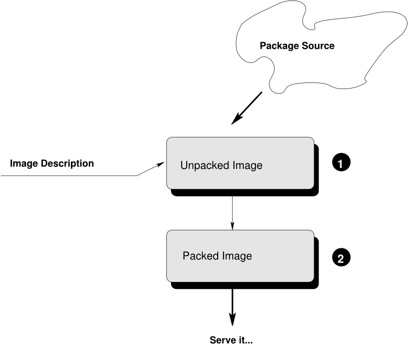
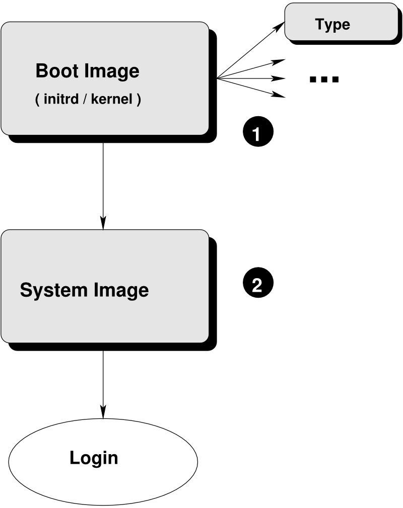

Basic Workflow
==============

.. hint:: **Abstract**

    Installation of a Linux system generally occurs by booting the target
    system from an installation source such as an installation CD/DVD, a live
    CD/DVD, or a network boot environment (PXE). The installation process is
    often driven by an installer that interacts with the user to collect
    information about the installation. This information generally includes the
    *software to be installed*, the *timezone*, system *user* data, and
    other information. Once all the information is collected, the installer
    installs the software onto the target system using packages from the
    software sources (repositories) available. After the installation is
    complete the system usually reboots and enters a configuration procedure
    upon start-up. The configuration may be fully automatic or it may include
    user interaction.
    This description applies for version |version|.

A system image (usually called "image"), is a *complete installation* of a Linux
system within a file. The image represents an operational system and,
optionally, contains the "final" configuration.

The behavior of the image upon deployment varies depending on the image type
and the image configuration since KIWI allows you to completely customize
the initial start-up behavior of the image. Among others, this includes
images that:

* can be deployed inside an existing virtual environment without requiring
  configuration at start-up.
* automatically configure themselves in a known target environment.
* prompt the user for an interactive system configuration.

The image creation process with KIWI is automated and does not require any
user interaction. The information required for the image creation process is
provided by the primary configuration file named :file:`config.xml`. 
This file is validated against the schema documented in
:ref:`Schema Documentation <schema-docs>` section.
In addition, the image can optionally be customized
using the :file:`config.sh` and :file:`images.sh` scripts
and by using an *overlay tree (directory)* called :file:`root`.
See `Components of an Image Description`_ section for further details.

.. note:: Previous Knowledge
    
    This documentation assumes that you are familiar with the general
    concepts of Linux, including the boot process, and distribution concepts
    such as package management.

Building Images
---------------

KIWI creates images in a two step process. The first step, the
``prepare`` operation, generates a so-called *unpacked image* tree
(directory) using the information provided in the :file:`config.xml`
configuration file. The :file:`config.xml` file is part of the *configuration
directory (tree)* that describes the image to be created by KIWI.

The second step, the ``create`` operation, creates the *packed image* or
*image* in the specified format based on the unpacked image and the information
provided in the :file:`config.xml` configuration file.

    Image Creation Architecture

(1) Unpacked Image
    Encapsulated system reachable via chroot

(2) Packed Image
    Encapsulated system reachable via kernel file system/extension drivers such
    as loopback mounts, etc.

.. _name-convention:

.. note:: KIWI configuration file name convention

   KIWI at first place looks for a configuration file named
   :file:`config.xml`. If there is no such file, KIWI looks for files with a 
   :regexp:`*.kiwi` extension. In that case, the first match is the loaded file.

.. _prepare-step:

The Prepare Step
................

The creation of an image with KIWI is a two step process. The first step is
called the ``prepare`` step and it must complete successfully before the
second step, the ``create`` step can be executed.

During the prepare step, KIWI creates an *unpacked image*, also called "root
tree". The new root tree is created in a directory specified on the command
line with the option `--root` argument or the value of the ``defaultroot``
element in the :file:`config.xml` file. This directory will be the installation
target for software packages to be installed during the image creation process.

For package installation, KIWI relies on the package manager specified with the
``packagemanager`` element in the :file:`config.xml` file. KIWI supports the
following package managers: ``dnf``, ``zypper`` (default), ``yum`` and
``apt/dpkg``.

The prepare step consists of the following substeps:

#. **Create Target Root Directory.**

   KIWI will exit with an error if the target root tree already exists to
   avoid accidental deletion of an existing unpacked image. 

#. **Install Packages.**

   Initially, KIWI configures the package manager to use the repositories
   specified in the configuration file and/or the command line. Following the
   repository setup, the packages specified in the ``bootstrap`` section of the
   configuration file are installed in a temporary workspace external to
   the target root tree. This establishes the initial environment to support
   the completion of the process in chroot setting. The essential packages to
   specify as part of the bootstrap environment are the ``filesystem`` and
   ``glibc-locale`` packages. The dependency chain of these two packages is
   sufficient to populate the bootstrap environment with all required software
   to support the installation of packages into the new root tree.

   The installation of software packages through the selected package manager
   may install unwanted packages. Removing such packages can be accomplished by
   marking them for deletion in the configuration file. To do so specify a
   configuration entry like:

   .. code-block:: xml

      <package type="delete">package_to_be_deleted</package>

#. **Apply the Overlay Tree.**

   After the package installation is complete, KIWI will apply all files and
   directories present in the overlay directory named :file:`root` to the target
   root tree. Files already present in the target root directory will be
   overwritten, others will be added. This allows you to overwrite any file
   that was installed by one of the packages during the installation phase.

#. **Apply Archives.**

   Any archive specified with the ``archive`` element in the :file:`config.xml`
   file is applied in the specified order (top to bottom) after the overlay
   tree copy operation is complete. Files and directories will be extracted
   relative to the top level of the new root tree. As with the overlay tree,
   it is possible to overwrite files already existing in the target root tree.

#. **Execute the User-defined Scripts** :file:`config.sh`.

   At the end of the preparation stage the script named :file:`config.sh` is
   executed if present. It is executed on the top level of the target root tree.
   The script's primary function is to complete the system configuration, for
   example, by activating services. See `Image Customization with
   config.sh Shell Script`_ section for further details.

#. **Manage The New Root Tree.**

   The unpacked image directory is a directory, as far as the build system is
   concerned you can manipulate the content of this directory according to
   your needs. Since it represents a system installation you can "chroot" into
   this directory for testing purposes. The file system contains an additional
   directory named :file:`/image` that is not present in a regular system. It
   contains information KIWI requires during the create step, including a copy
   of the :file:`config.xml` file.

   Do not make any changes to the system, since they will get lost when
   re-running the ``prepare`` step again. Additionally, you may introduce errors
   that will occur during the ``create`` step which are difficult to track. The
   recommended way to apply changes to the unpacked image directory is to change
   the configuration and re-run the ``prepare`` step.

.. _create-step:

The Create Step
...............

The successful completion of the ``prepare`` step is a prerequisite for the
``create`` step. It ensures the unpacked root tree is complete and consistent.
Creating the packed, or final, image is done in the ``create`` step. Multiple
images can be created using the same unpacked root tree. It is, for example,
possible to create a self installing OEM image and a virtual machine image from
a single unpacked root tree. The only prerequisite is that both image types are
specified in the :file:`config.xml` before the prepare step is executed.

During the ``create`` step the following major operations are performed by
KIWI:

#. **Execute the User-defined Script** ``images.sh``.

   At the beginning of the image creation process the script named
   :file:`images.sh` is executed if present. It is executed on the top level of
   the target root tree. The script is usually used to remove files that are no
   needed in the final image. For example, if an appliance is being built for a
   specific hardware, unnecessary kernel drivers can be removed using this
   script. 
   
#. **Create Requested Image Type.** 

   The image types that can be created from a prepared image tree depend on the
   types specified in the image description :file:`config.xml` file. The
   configuration file must contain at least one ``type`` element. 
  
   The currently supported image types are:
   
   #. **Live Image**: For CDs, DVDs or flash disks.

   #. **Disk image**: Virtual system disk that can be used in virtual
      environments such as VMware, Xen, Amazon Cloud, KVM, and others. Depending
      on the format a guest configuration file is created. 

   #. **OEM Image**: Preload system for install media CD/DVD or flash disk.

   #. **PXE Image**: Network boot image.

   #. **Container Image**: Base images for the Docker engine.

.. _description_components:

Components of an Image Description
----------------------------------

A KIWI image description can composed by several parts. The main part is
the KIWI description file itself (named :file:`config.xml` or an arbitrary
name plus the :file:`*.kiwi` extension). The configuration XML is the
only required component, others are optional.

These are the optional components of an image description:

#. ``config.sh`` shell script

   Is the configuration shell script that runs and the end of the
   :ref:`prepare step <prepare-step>` if present. It can be used to
   fine tune the unpacked image.

#. ``images.sh`` shell script

   Is the configuration shell script that runs at the begining of the
   create step. So it is expected to be used to handle image type specific
   tasks.

#. Overlay tree directory

   The *overlay tree* is a folder (called :file:`root`) 
   or a tarball file (called :file:`root.tar.gz`) that contains
   files and directories that will be copied to the target image build tree
   during the :ref:`prepare step <prepare-step>`. It is executed
   after all the packages included in the :file:`config.xml` file
   have been installed. Any already present file is overwritten.

#. Archives included in the :file:`config.xml` file.

   The archives that are included in the `<packages>` using the `<archive>`
   subsection:

   .. code:: xml

      <packages type="image">
          <archive name="custom-archive.tgz"/>
      </packages>

Image Customization with ``config.sh`` Shell Script
...................................................

The KIWI image description allows to have an optional :file:`config.sh` bash
script in place. It can be used for changes appropriate for all images
to be created from a given unpacked image (since config.sh runs prior
to create step). Basically the script should be designed to take over
control of adding the image operating system configuration. Configuration
in that sense means all tasks which runs once in an os installation process
like activating services, creating configuration files, prepare an
environment for a firstboot workflow, etc. The :file:`config.sh` script is
called at the end of the :ref:`prepare step <prepare-step>` (after
users have been set and the *overlay tree directory* has been applied). If
:file:`config.sh` exits with an exit code != 0 the kiwi process will
exit with an error too.

See below a common template for `config.sh` script:

.. code:: bash

   #======================================
   # Functions...
   #--------------------------------------
   test -f /.kconfig && . /.kconfig
   test -f /.profile && . /.profile
   
   #======================================
   # Greeting...
   #--------------------------------------
   echo "Configure image: [$kiwi_iname]..."
   
   #======================================
   # Mount system filesystems
   #--------------------------------------
   baseMount
   
   #======================================
   # Call configuration code/functions
   #--------------------------------------
   ...
   
   #======================================
   # Umount kernel filesystems
   #--------------------------------------
   baseCleanMount

   #======================================
   # Exit safely
   #--------------------------------------
   exit 0

Common Functions
''''''''''''''''

The :file:`.kconfig` file allows to make use of a common set of functions. 
Functions specific to SUSE Linux specific begin with the name suse.
Functions applicable to all linux systems starts with the name base.
The following list describes the functions available inside the
:file:`config.sh` script.

``baseCleanMount``
  Umount the system filesystems :file:`/proc`, :file:`/dev/pts`, and
  :file:`/sys`.

``baseDisableCtrlAltDel``
  Disable the Ctrl–Alt–Del key sequence setting in :file:`/etc/inittab`.

``baseGetPackagesForDeletion``
  Return the name(s) of packages which will be deleted.

``baseGetProfilesUsed``
  Return the name(s) of profiles used to build this image.

``baseSetRunlevel {value}``
  Set the default run level.

``baseSetupBoot``
  Set up the linuxrc as init.

``baseSetupBusyBox {-f}``
  Activates busybox if installed for all links from the
  :file:`busybox/busybox.links` file—you can choose custom apps to be forced
  into busybox with the -f option as first parameter, for example:

  .. code:: bash

     baseSetupBusyBox -f /bin/zcat /bin/vi

``baseSetupInPlaceGITRepository``
  Create an in place git repository of the root directory. This process
  may take some time and you may expect problems with binary data handling.

``baseSetupInPlaceSVNRepository {path_list}``
  Create an in place subversion repository for the specified directories.
  A standard call could look like this baseSetupInPlaceSVNRepository
  :file:`/etc`, :file:`/srv`, and :file:`/var/log`.

``baseSetupPlainTextGITRepository``
  Create an in place git repository of the root directory containing all
  plain/text files.

``baseSetupUserPermissions``
  Search all home directories of all users listed in :file:`/etc/passwd` and
  change the ownership of all files to belong to the correct user and group.

``baseStripAndKeep {list of info-files to keep}``
  Helper function for strip* functions read stdin lines of files to check
  for removing params: files which should be keep.

``baseStripDocs {list of docu names to keep``
  Remove all documentation, except one given as parameter.

``baseStripInfos {list of info-files to keep}``
  Remove all info files, except one given as parameter.

``baseStripLocales {list of locales}``
  Remove all locales, except one given as parameter.

``baseStripMans {list of manpages to keep}``
  Remove all manual pages, except one given as parameter
  example:

  .. code:: bash
 
     baseStripMans more less

``baseStripRPM``
  Remove rpms defined in :file:`config.xml` in the image type=delete section.

``suseRemovePackagesMarkedForDeletion``
  Remove rpms defined in :file:`config.xml` in the image `type=delete`
  section. The difference compared to `baseStripRPM` is that the suse
  variant checks if the package is really installed prior to passing it
  to rpm to uninstall it. The suse rpm exits with an error exit code
  while there are other rpm version which just ignore if an uninstall
  request was set on a package which is not installed.

``baseStripTools {list of toolpath} {list of tools}``
  Helper function for suseStripInitrd function params: toolpath, tools.

``baseStripUnusedLibs``
  Remove libraries which are not directly linked against applications
  in the bin directories.

``baseUpdateSysConfig {filename} {variable} {value}``
  Update sysconfig variable contents.

``Debug {message}``
  Helper function to print a message if the variable DEBUG is set to 1.

``Echo {echo commandline}``
  Helper function to print a message to the controlling terminal.
 
``Rm {list of files}``
  Helper function to delete files and announce it to log.

``Rpm {rpm commandline}``
  Helper function to the RPM function and announce it to log.

``suseConfig``
  Setup keytable language, timezone and hwclock if specified in
  :file:`config.xml` and call SuSEconfig afterwards SuSEconfig is only
  called on systems which still support it.

``suseInsertService {servicename}``
  This function calls baseInsertService and exists only for
  compatibility reasons.

``suseRemoveService {servicename}``
  This function calls baseRemoveService and exists only for
  compatibility reasons.

``baseInsertService {servicename}``
  Activate the given service by using the :command:`chkconfig`
  or :command:`systemctl` program. Which init system is in use
  is auto detected.

``baseRemoveService {servicename}``
  Deactivate the given service by using the :command:`chkconfig`
  or :command:`systemctl` program. Which init system is in
  use is auto detected.

``baseService {servicename} {on|off}``
  Activate/Deactivate a service by using the :command:`chkconfig`
  or :command:`systemctl` program. The function requires the service
  name and the value on or off as parameters. Which init system is in
  use is auto detected.

``suseActivateDefaultServices``
  Activates the following sysVInit services to be on by default using
  the :command:`chkconfig` program: boot.rootfsck, boot.cleanup,
  boot.localfs, boot.localnet, boot.clock, policykitd, dbus, consolekit,
  haldaemon, network, atd, syslog, cron, kbd. And the following for
  systemd systems: network, cron.

``suseSetupProduct``
  This function creates the baseproduct link in :file:`/etc/products.d`
  pointing to the installed product.

``suseSetupProductInformation``
  This function will use zypper to search for the installed product
  and install all product specific packages. This function only
  makes sense if zypper is used as package manager.

``suseStripPackager {-a}``
  Remove smart or zypper packages and db files Also remove rpm
  package and db if -a given.

Profile Environment Variables
'''''''''''''''''''''''''''''

The :file:`.profile` environment file contains a specific set of
variables which are listed below. Some of the functions above
use the variables.

``$kiwi_compressed``
  The value of the compressed attribute set in the type element
  in :file:`config.xml`.

``$kiwi_delete``
  A list of all packages which are part of the packages section
  with `type="delete"` in :file:`config.xml`.

``$kiwi_drivers``
  A comma separated list of the driver entries as listed in the
  drivers section of the :file:`config.xml`.

``$kiwi_iname``
  The name of the image as listed in :file:`config.xml`.

``$kiwi_iversion``
  The image version string major.minor.release.

``$kiwi_keytable``
  The contents of the keytable setup as done in :file:`config.xml`.

``$kiwi_language``
  The contents of the locale setup as done in :file:`config.xml`.

``$kiwi_profiles``
  A list of profiles used to build this image.

``$kiwi_size``
  The predefined size value for this image. This is not the
  computed size but only the optional size value of the preferences
  section in :file:`config.xml`.

``$kiwi_timezone``
  The contents of the timezone setup as done in :file:`config.xml`.

``$kiwi_type``
  The basic image type.

Configuration Tips
''''''''''''''''''

In this section some ideas of how :file:`config.sh` file could be used to
fine tune the resulting unpacked image are quickly described:

#. **Stateless systemd UUIDs:**

  Usually during the image packages installation when *dbus* and/or
  *systemd* are installed machine ID files are created and set
  (:file:`/etc/machine-id`, :file:`/var/lib/dbus/machine-id`). Those
  UUIDs are meant to be unique and set only once in each deployment. In
  order to ensure that every single box running out from the same image
  has its own specific systemd UUID, the original image must not include
  any systemd or dbus ID, this way it is assigned during the first boot.
  The following bash snippet allows this behavior in :file:`config.sh`:

  .. code:: bash

     #======================================
     # Make machine-id stateless
     #--------------------------------------
     if [ -e /etc/machine-id ]; then
         > /etc/machine-id
         if [ -e /var/lib/dbus/machine-id ]; then
             rm /var/lib/dbus/machine-id
         fi
         ln -s /etc/machine-id /var/lib/dbus/machine-id
     fi

  .. note:: Avoid interactive boot

     It is important to remark that the file :file:`/etc/machine-id`    
     is set to an empty file instead of deleting it. Systemd may trigger 
     :command:`systemd-firstboot` service if this file is not present,
     which leads to an interactive firstboot where the user is
     asked to provide some data.

Image Customization with ``images.sh`` Shell Script
...................................................

The KIWI image description allows to have an optional :file:`images.sh`
bash script in place. It can be used for changes appropriate for
certain images/image types on case-by-case basis (since it runs at
beginning of :ref:`create step <create-step>`). Basically the script
should be designed to take over control of handling image type specific
tasks. For example if building the oem type requires some additional
package or config it can be handled in :file:`images.sh`. Please keep in
mind there is only one unpacked root tree the script operates in. This
means all changes are permanent and will not be automatically restored.
It is also the script authors tasks to check if changes done before do not
interfere in a negative way if another image type is created from the
same unpacked image root tree. If :file:`images.sh` exits with an exit
code != 0 the kiwi process will exit with an error too.

See below a common template for :file:`images.sh` script:

.. code:: bash

   #======================================
   # Functions...
   #--------------------------------------
   test -f /.kconfig && . /.kconfig
   test -f /.profile && . /.profile
   
   #======================================
   # Greeting...
   #--------------------------------------
   echo "Configure image: [$kiwi_iname]..."
   
   #======================================
   # Call configuration code/functions
   #--------------------------------------
   ...
   
   #======================================
   # Exit safely
   #--------------------------------------
   exit

Common Functions
''''''''''''''''

The :file:`.kconfig` file allows to make use of a common set of functions.
Functions specific to SUSE Linux specific begin with the name *suse*.
Functions applicable to all linux systems starts with the name *base*.
The following list describes the functions available inside the
:file:`images.sh` script.

``baseCleanMount``
  Umount the system file systems :file:`/proc`, :file:`/dev/pts`,
  and :file:`/sys`.

``baseGetProfilesUsed``
  Return the name(s) of profiles used to build this image.

``baseGetPackagesForDeletion``
  Return the list of packages setup in the packages *type="delete"*
  section of the :file:`config.xml` used to build this image.

``suseGFXBoot {theme} {loadertype}``
  This function requires the gfxboot and at least one *bootsplash-theme-**
  package to be installed to work correctly. The function creates from
  this package data a graphics boot screen for the isolinux and grub boot
  loaders. Additionally it creates the bootsplash files for the
  resolutions 800x600, 1024x768, and 1280x1024.

``suseStripKernel``
  This function removes all kernel drivers which are not listed in the
  drivers sections of the :file:`config.xml` file.

``suseStripInitrd``
  This function removes a whole bunch of tools binaries and libraries
  which are not required to boot a suse system with KIWI.

``Rm {list of files}``
  Helper function to delete files and announce it to log.

``Rpm {rpm commandline}``
  Helper function to the rpm function and announce it to log.

``Echo {echo commandline}``
  Helper function to print a message to the controlling terminal.

``Debug {message}``
  Helper function to print a message if the variable *DEBUG* is set to 1.

Profile environment variables
'''''''''''''''''''''''''''''

The :file:`.profile` environment file contains a specific set of
variables which are listed below. Some of the functions above use the
variables.

``$kiwi_iname``
  The name of the image as listed in :file:`config.xml`.

``$kiwi_iversion``
  The image version string major.minor.release.

``$kiwi_keytable``
  The contents of the keytable setup as done in :file:`config.xml`.

``$kiwi_language``
  The contents of the locale setup as done in :file:`config.xml`.

``$kiwi_timezone``
  The contents of the timezone setup as done in :file:`config.xml`.

``$kiwi_delete``
  A list of all packages which are part of the packages section with
  *type="delete"* in :file:`config.xml`.

``$kiwi_profiles``
  A list of profiles used to build this image.

``$kiwi_drivers``
  A comma separated list of the driver entries as listed in the drivers
  section of the :file:`config.xml`.

``$kiwi_size``
  The predefined size value for this image. This is not the computed size
  but only the optional size value of the preferences section in 
  :file:`config.xml`.

``$kiwi_compressed``
  The value of the compressed attribute set in the type element in
  :file:`config.xml`.

``$kiwi_type``
  The basic image type.

Customizing the Boot Process
----------------------------

Most Linux systems use a special boot image to control the system boot process
after the system firmware, BIOS or UEFI, hands control of the hardware to the
operating system. This boot image is called the :file:`initrd`. The Linux kernel
loads the :file:`initrd`, a compressed cpio initial RAM disk, into the RAM and
executes :command:`init` or, if present, :command:`linuxrc`.

Depending on the image type, KIWI creates the boot image automatically during
the ``create`` step. Each image type has its own description for the boot image.
Common functionality is shared between the boot images through a set of
functions. The boot image descriptions follow the same principles as the system
image descriptions, KIWI ships with pre-defined boot image descriptions.

This is the default behavior of KIWI and provides support for multiple boot
modes like *oem install*, *pxe install*, *live images*, *network clients*, etc.
However this KIWI version also provides support for :command:`dracut`
generated images which is used when fast boot or small *initrd* images are
important requirements. This is possible by setting the ``initrd_system``
attribute within the ``type`` section of the configuration file. For example:

.. code-block:: xml

   <type image="vmx" initrd_system="dracut"/>

.. important:: dracut images limited features

   The counter part of using :command:`dracut` images is that only
   limited features are supported in this case. In fact, all the following
   documentation about customizing the boot process does not apply using
   :command:`dracut` images. ``initrd_system`` is only available for *oem* and
   *vmx* image types.

.. note:: Boot Image Descriptions provided by KIWI

   The boot image descriptions provided by KIWI cover almost all use
   cases. Creating custom boot descriptions should not be necessary, unless you
   have special requirements. 

   Image Descriptions

#. **Boot Image**

   Boot image descriptions are provided by KIWI, use is recommended but not
   required.

#. **System Image**

   The system image description is created by the KIWI user or a KIWI
   provided template may be used.

The boot image descriptions are stored in the
:file:`<INSTALL-DIR>/kiwi/boot/*` directories. KIWI selects the boot image
based on the value of the ``boot`` attribute of the ``type`` element. The
attribute value is expected in the general form of *BOOTTYPE*/*DISTRIBUTION*.
For example to select the OEM boot image for SLES version 12 the element would
look like the following:

.. code-block:: xml

   <type boot="oemboot/suse-SLES12">

.. important:: Difference Between Boot Image and System Image
   Descriptions

   The *boot image description* only represents the initrd used to boot the
   system and as such serves a limited purpose. The boot image descriptions is
   used to build the boot image independently from the system image. Usually a
   pre-defined boot image descriptions shipped with KIWI is used.

   The system image description is used to build the image running on the target
   system. It is manually created and usually tailor-made for a specific use case.

.. tip:: De-activating Hooks at Boot Time
   
   .. code-block:: bash 
   
      KIWI_FORBID_HOOKS=1

Boot Image Hook-Scripts
.......................

All KIWI created boot images contain KIWI boot code that gets executed when the
image is booted for the first time. This boot code differs from image type to
image type. It provides hooks to execute user defined shell scripts.

These scripts may extend the firstboot process and are expected to exist inside
the boot image in a specific location with specific names. The following
instructions explain the concept of hook scripts, which is common to all image
types, and how to include the scripts in the initrd.

Script Types
''''''''''''

Hook scripts are executed using a predetermined name that is hard coded into the
KIWI boot code. This name is extended using the :file:`.sh` extension and
differs by boot image type. Therefore, the boot script naming in the archive
must be exact. Boot scripts are sourced in the kiwi boot code. This provides the
hook script access to all variables set in the boot environment. This also
implies that no separate shell process is started and the boot scripts do not
need to have the executable bit set. Encoding the interpreter location with the
``#!`` shebang is superfluous.

The following list provides information about the hook names, timing of the
execution, and the applicable boot image.

``handleMachineID``
  This hook is called as part of the pre-init phase when the system root
  mountpoint has already been moved and is ready to hand over the control
  to the init system. It's purpose is to setup the machine id as used by
  systemd and dbus. Under normal conditions it is preferred to write a
  systemd firstboot service script to setup the machine id. However
  depending on the distribution such a service might not exist and in
  this case the machine id setup can be done from within that kiwi
  hook script.

``handleSplash``
  This hook is called prior to any dialog/exception message or progress dialog.
  The hook can be used to customize the behavior of the splash screen. KIWI
  automatically hides a plymouth or kernel based splash screen if there is only
  one active console.

``init``
  This hook is called before udev is started.
  
``preconfig`` | ``postconfig``
  The hooks are called before and after the client configuration files (CONF
  contents) are setup, respectively. The hooks only exist for the *PXE* image
  type.

``predownload`` | ``postdownload``
  The hooks are called before and after the client image receives the root file
  system, respectively. The hooks only exist for the *PXE* image type.

``preImageDump`` | ``postImageDump``
  The hooks are called before and after the install image is dumped on the
  target disk, respectively. The hooks only exist for the *OEM* image type.

``preLoadConfiguration`` | ``postLoadConfiguration``
  The hooks are called before and after the client configuration file
  :file:`config.MAC` is loaded, respectively. The hooks only exist for the
  *PXE* image type.

``premount`` | ``postmount``
  The hooks are called before and after the client root file system is mounted,
  respectively. The hooks only exist for the PXE image type. 

``prenetwork`` | ``postnetwork``
  The hooks are called before and after the client network is setup,
  respectively. The hooks only exist for the *PXE* image type.

``prepartition`` | ``postpartition``
  The hooks are called before and after the client creates the partition table
  on the target disk, respectively. The hooks only exist for the *PXE* image
  type.

``preprobe`` | ``postprobe``
  The hooks are called before and after the loading of modules not handled by
  udev, respectively.

``preswap`` | ``postswap``
  The hooks are called before and after the creation of the swap space,
  respectively. The hooks only exist for the *PXE* image type.

``preactivate``
  This hook is called before the root file system is moved to :file:`/`.

``preCallInit``
   This hook is called before the initialization process, init or systemd, is
   started. At call time the root file system has already been moved to
   :file:`/`. The hook only exists for the *OEM* and *VMX* image types.

``preRecovery`` | ``postRecovery``
  This hook is called before and after the recovery code is processed. At call
  time of preRecovery the recovery partition is not yet mounted. At call time
  of postRecovery the recovery partition is still mounted on :file:`/reco-save`.
  The hook only exists for the *OEM* image type.

``preRecoverySetup`` | ``postRecoverySetup``
  This hook is called before and after the recovery setup is processed. At call
  time of preRecoverySetup the recovery partition is not yet mounted. At call
  time of postRecoverySetup the recovery partition is still mounted on
  :file:`/reco-save`. The hook only exists for the *OEM* image type.

``preException``
  This hook is called before a system error is handled. The error message is
  passed as parameter. This hook can be used for all image types.

``preHWdetect`` | ``postHWdetect``
  The hooks are called before and after the install image boot code detects
  the possible target storage device(s). The hooks only exist for the *OEM*
  image type.
  
``preNetworkRelease``
  This hook is called before the network connection is released. The hook only
  exists for the *PXE* image type.

Including Hook Scripts into the Boot Image
''''''''''''''''''''''''''''''''''''''''''

All hook scripts must be located in the :file:`kiwi-hooks` directory at the top
level of the initrd. The best approach to including the hook scripts in the
initrd is to create an archive of a :file:`kiwi-hooks` directory that contains
the custom boot scripts.

.. code-block:: bash

   mkdir kiwi-hooks
   # place all scripts inside kiwi-hooks
   tar -cf kiwi-hooks.tgz kiwi-hooks/

The TAR archive must be located at the top level of the image description
directory, this is the same level that contains the :file:`config.xml` file.

Hook scripts are only executed within KIWI's boot code and must therefore be
part of the KIWI created boot image. Including the content of a TAR archive in
the initrd is accomplished by setting the value of the ``bootinclude`` attribute
of the ``archive`` element to true in the :file:`config.xml` file as shown
below:

.. code-block:: xml

   <packages type="image">
     <archive name="kiwi-hooks.tgz" bootinclude="true"/>
   </packages>

The concept of including an archive in the boot image follows the same concepts
described for the system image previously. To use an archive in a pre-built boot
image the archive must be part of the boot image description in which case it is
not necessary to set the ``bootinclude`` attribute.

Post Commands
'''''''''''''

In addition to the hook script itself it is also possible to run a post command 
after the hook script was called. This allows to run commands tied to a hook
script without changing the initrd and thus provides a certain flexibility when
writing the hook. The post command execution is based on variables that can be 
passed to the kernel command line. The following rules for the processing post
commands apply: 

#. Command post processing needs to be activated within the corresponding hook
   script. this is achieved by setting the variable 
   :literal:`KIWI_ALLOW_HOOK_CMD_hookname` to ``1``. For example:

   .. code-block:: bash

      KIWI_ALLOW_HOOK_CMD_preHWdetect=1

   This will activate the post command execution for the ``preHWdetect`` hook.
   If this variable is not set, the post command will not be executed.

#. The corresponding variable :literal:`KIWI_HOOK_CMD_hookname`
   needs to passed to the Kernel command line. Its value contains the command
   that is to be executed, for example:

   .. code-block:: bash

      KIWI_HOOK_CMD_preHWdetect="ls -l"

.. tip:: To disable all post commands for the current boot process pass the
   following variable to the Kernel command line:

   .. code-block:: bash

      KIWI_FORBID_HOOK_CMDS=1

Boot Parameters
...............

A KIWI created initrd based on one of the KIWI provided boot image descriptions
recognizes kernel parameters that can be useful for debugging purposes or to set
some specific boot variables. These parameters may not work if the image
contains a custom boot image where the KIWI boot code has been replaced, and the
parameters are not recognized after the initial KIWI created initrd has been
replaced by the "regular" distribution created initrd after the initial boot of
the image.

The following list are some of the variables that might be included as kernel
parameters:

``BOOTIF``
  This variable sets the interface to boot in *PXE* images. It's the MAC
  address of the desired interface. If ``BOOTIF`` is not set the boot code
  selects the first interface responding to the DHCP server.

``DEVICE_TIMEOUT``
  This variable sets the time (in seconds) that the system waits until a
  storage device is considered to be unaccessible. By default, this value is set
  to 60 seconds. It can be handy in order to limit the wait time, specially
  if there are operations pending on removable devices which may not be always
  present.

``DIALOG_LANG``
  This variable holds the language code that will be used to select the
  corresponding language literals used in the installation dialogs. By default
  is set to 'ask', it meaning the user is prompted to select one. If unattended
  mode has been selected, ``DIALOG_LANG`` is always set to US English.

``KIWI_ALLOW_HOOK_CMD_hookname``
  This variable enables the execution of a command right after the execution of
  the corresponding hook script identified by *hookname*. If set to ``1`` the
  post command related to *hookname* will be executed. 
  
``kiwi_cowdevice``
  This variable sets the device to use for copy-on-write (cow) operations
  in hybrid images. If used, ``kiwi_cowsystem`` also needs to be defined.

``kiwi_cowsystem``
  This variable sets the cow file to use inside the write partition defined by
  ``kiwi_device`` in hybrid images. If used, ``kiwi_cowdevice`` also needs to
  be defined.

``kiwidebug``
  This variable sets to enter on a limited shell in case there is a fatal error
  during the boot process. The default behavior is to reboot after 120 seconds,
  this variable prevents this behavior setting its value to ``1``.

``KIWI_FORBID_HOOKS``
  This variable disables all post commands int he boot process.

``KIWI_HOOK_CMD_hookname``
  This variable sets the post command of the corresponding hook script
  identified by *hookname*. The value must be the command line including
  all arguments all in a single string.

``kiwi_hybridpersistent``
  This variable sets if a write partition for hybrid images should be created or
  not. It is boolean value represented by 'true' or 'false'.

``kiwi_hybridpersistent_cow_filename``
  This variable sets the filename of the cow file for hybrid images. By default
  it is set to ``Live OS's persistent storage.fs``.

``kiwi_hybridpersistent_filesystem``
  This variable sets the filesystem to be used within the write partition of
  hybrid images. By default is set to btrfs.

``kiwi_ramonly``
  This variable sets to mount the clicfs or unionfs read/write device on a
  ram disk or not. Any empty value activates the ramonly mode.

``kiwinoswapsearch``
  This variable prevents the search for an existing swap partition.
  The lookup of a swap partition is done when using the oem
  installer in partition based installation mode or on live images
  in order to activate swap when it exists.

Boot Debugging
''''''''''''''

If the boot process encounters a fatal error, the default behavior is to reboot
the system after 120 seconds. Prevent this behavior by using the ``kiwidebug``
parameter described in the previous sections by setting its value to ``1``:

.. code-block:: bash

   kiwidebug=1

This should be set the Kernel command line. With that parameter set to 1, the
system will enter a limited shell environment in case of a fatal during boot.
The shell contains a basic set of commands. The first place to look for
debugging information should be the boot log file :file:`/var/log/kiwi.boot`.

In addition to the shell, KIWI also starts the *dropbear* SSH server if the
environment is suitable. Support for *dropbear* can be added to the netboot and
oemboot (in PXE boot mode) boot images. For isoboot and vmxboot boot images
there is no remote login support because they do not set up a network. It is
required that the repository setup provides ``dropbear`` package. 

To have dropbear installed as part of the boot image the following needs to be
added to the system image configuration:

.. code-block:: xml

   <packages type="image">
     <package name="dropbear" bootinclude="true"/>
   </packages>

It might be useful to also include a tool for copying remote files, such as
:command:`scp` or :command:`rsync` into the boot image. Note that the required
packages need to be provided by the repositories configured. To include
:command:`rsync`, for example, add the line ``<package name="rsync"
bootinclude="true"/>`` to the listing above.

To access the boot image via SSH it is required to provide a public key on the
PXE server in the directory: :file:`SERVER-ROOT/KIWI/debug_ssh.pub`. KIWI
exclusively searches for that file name, so it is required to name it
:file:`debug_ssh.pub`. :file:`SERVER-ROOT` depends on what server type was
configured to download the image. By default this is done via TFTP. In that case
:file:`SERVER-ROOT` translates to :file:`/srv/tftpboot` on the PXE server.
Adjust the path accordingly if having used HTTP or FTP.

Adding more than one public key to file is possible, the file uses the same
format as the common SSH file "authorized_keys". If a public key was found login
as follows:

.. code-block:: bash

   ssh root@IP-ADDRESS

In case :command:`rsync` is available, copy the KIWI boot log to your local
machine as follows:

.. code-block:: bash

   RSYNC_RSH='ssh -l root'
   rsync -avz <ip>:/var/log/boot.kiwi

FAQ: Boot Image Customization
.............................

The KIWI provided boot image descriptions should satisfy the requirements for a
majority of image builds and the environments in which these images are
deployed. In case a customized boot image is needed, KIWI provides appropriate
configuration options in :file:`config.xml`.

Using these options allow users to base the boot image on the KIWI provided
descriptions rather than having to define a configuration from scratch (however,
this is possible if wanted). The following question and answer section provides
solutions to the most common scenarios that require a customized boot image. 

**Why is the boot image so big? Can I reduce its size?**
  KIWI includes all required tools and libraries to boot the image under all
  circumstances in all target environments supported by the image type. In case
  the target environment is well defined it is possible to remove libraries,
  drivers and tools not needed in the target environment.

  This will decrease the size of the initrd and will also decrease boot time.
  Removing files in the boot image is accomplished by adding a ``strip``
  section to the system image in the :file:`config.xml` file, with the ``type``
  attribute set to ``delete``, as shown below:

  .. code-block:: xml

     <strip type="delete">
       <file name="..."/>
     </strip>

**Can drivers be added to the boot image?**
  KIWI uses a subset of the Kernel. Therefore drivers shipped with the Kernel 
  that have not been included by the KIWI build process, can be added. Do so
  by adding a ``drivers`` section to the system image configuration file
  :file:`config.xml`, as follows:

  .. code-block:: xml
     
     <drivers>
       <file name="drivers/..."/>
     </drivers>

  If the driver is provided by a package, the package itself needs to be
  specified as part of the ``image`` package section. Additionally, it must be
  marked for boot image inclusion by setting the value of the ``bootinclude``
  attribute of the ``package`` element to ``true``, as follows: 

  .. code-block:: xml

     <packages type="image">
       <package name="PACKAGE" bootinclude="true"/>
     </packages>

**How to add missing tools or libraries**
  Additional software can be added to the boot image with the use of the
  ``bootinclude`` attribute of the ``package`` or the ``archive`` element. At
  the end of the boot image creation process kiwi attempts to reduce the size
  of the boot image by removing files that are not part of a known list of
  required files or their dependencies.

  The list of required files is hard coded in the
  :file:`<install-dir>kiwi/config/strip.xml` file. If you added files to the
  boot image that are needed for your specific use case, you need to instruct
  kiwi to not strip them from the image. This is accomplished by adding a
  ``strip`` section to the system image :file:`config.xml` file, with the type
  attribute set to tools, as follows:

  .. code-block:: xml

     <strip type="tools">
       <file name="FILENAME"/>
     </strip>

  The removal/preservation of files is name-based only, so you do not need to
  specify a complete path, but rather the file name.

**Is it possible to add boot code?**
  Yes, as described in the `Boot Image Hook-Scripts`_ section above, KIWI
  supports the execution of boot code at various times for various image types
  using *hook* scripts. 

**Is it possible to include completely customized boot code?**
  No. In cases where the provided hooks are insufficient and the KIWI provided
  boot code needs to be replaced completely, it is necessary to create a custom
  boot image description. In this case, all parts of the boot image description
  must be created by the user. It is best to use one of the KIWI provided boot
  descriptions as a template. 

**My customized boot image refuses to boot. How to debug?**
  An initrd created by KIWI that is based on one of the KIWI-provided boot
  image descriptions recognizes kernel parameters that are useful for debugging
  purposes, in case the image does not boot. These parameters may not work if
  the image contains a custom boot image where the KIWI boot code has been
  completely replaced. Some hints are described in `Boot Debugging`_ section.

Distribution Specific Code
--------------------------

KIWI is designed to be distribution-independent. However, Linux distributions
differ from each other, primarily in the package management area and in the area
of creation and composition of the boot image. The boot image code has been
written as generic as possible, so all supported distributions use the same boot
code. Within the KIWI code base, major areas of Linux distribution differences
are isolated into specific and delimited regions of the code. 

